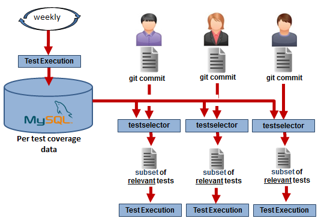

# krakatoa
Test selection and other tools and reports using code coverage data.

The goals:
* test selection using historical coverage data
* test to source code traceability

Assumptions:
- see mysql/create.sql for details on DB schema and assumptions on uniqueness.
- testselector assumes all test names are not generated at run time. Thus allowing us to select them prior to execution.

This project includes
* An example on how per test coverage data can be generated with gcov and loaded into MySQL
* A MySQL schema to store and query function coverage efficiently
* gcov2covDB java program to convert .gcov files into .csv files that can be loaded into MySQL
* testselector script to select a subset of tests based on coverage data.
* perdircoverage java program to generate an html collapsable tree showing coverage for each source code directory.


# What is krakatoa testselector ?
For large testsuites it often becomes impossible to run all the tests on each code change.

It becomes imperative to be able to select a subset of tests which are relevant to the changes made.

This project uses test coverage data to identify relevant tests.

To achieve this, all tests must be executed to extract coverage data for each individual test.
This is usually perfomed daily or weekly depending on the duration of the tests. More frequent is better.
Once this is available, developers can use the testselector tool to select which tests should be executed. 
It selects only tests that were known in the recent past to exercise the modified files or functions.

How data is gathered and used:



This system was originally aimed at C++ applications but can be used with any language and testing framework.
Initialy the only supported source of coverage data is gcov, however this approach can be integrated with any system that can generate function coverage. Extend gcov2covDB to parse other types of input data.

Input:
* Per test function coverage data collected periodically, daily or weekly, stored in MySQL using the provided schema
* The project git repo
* A list of git commits or functions to use to determine relevant tests

The rule used to select tests are very simple:
* select all tests that call at least one of the modified functions in the specified git change sets.

   OR
* select all tests that call at least one function in one of the modified files in the specified git change sets.

   OR
* select all tests that call one of the specified functions

   OR
* select all tests that call a function in one of the specified files

Output:
* List of relevant tests in specified format


## testselector usage 

* cd into your repo
* Invoke '''''testselector''''' to create a Krakatoa.mira test suite.

Try this first:
```
 testselector --help
```


###  The default is to select tests covering code in modified functions in last commit
```
 cd /repo/gitproject
 testselector
For commits:
     cafe703383463a6494956ac5b98ff96e94c4ae0a
Searching for tests in:
     regression.mira
Which exercise code in one of the following 8 functions:
     RdSrv::generateCapabilityMismatchString
     RdSrv::hasComparableBranchCap
     RdSrv::hasComparableCapToLocked
     RdBranchCapabilityCfmMessageHandler::handleTxPower
     RdClientTxRxBranch::isCarrierDataRequired
     RdModel::getBranchCarrierDataCapability
     TxLoSrvIru::isTxLoToBeChanged
     TxLoSrvIru::postInitializeService
For 10 matching functions,
     Eqp::RdSrv::generateCapabilityMismatchString(Rd::BranchBandCapability const&, Rd::BranchBandCapability const&, std::string&)
     Eqp::RdSrv::generateCapabilityMismatchString(Rd::BranchFreqCapability const&, Rd::BranchFreqCapability const&, std::string&)
     Eqp::RdSrv::generateCapabilityMismatchString(Rd::BranchRxGainCapability const&, Rd::BranchRxGainCapability const&, std::string&)
     Eqp::RdSrv::generateCapabilityMismatchString(Rd::BranchTxPowerCapability const&, Rd::BranchTxPowerCapability const&, std::string&)
     Eqp::RdSrv::hasComparableBranchCap(unsigned int, std::string&)
     Eqp::RdSrv::hasComparableCapToLocked(unsigned int, std::string&)
     Rd::RdBranchCapabilityCfmMessageHandler::handleTxPower(unsigned int, Rd::BranchEnumType, capTxPowerMeasS&)
     Rd::RdClientTxRxBranch::isCarrierDataRequired()
     Tx::Service::TxLoSrvIru::isTxLoToBeChanged(Frequency&)
     Tx::Service::TxLoSrvIru::postInitializeService()
selected the following tests for each test positions used to collect coverage data:
Pos. Test suite       Total Selected Total(mins) Selected(mins) Savings(mins) Testrun_id Date_tested
-    -                -     -        -           -              -             -          -          
119  regression.mira  218   0        168         0              168           290        2016-03-20 
157  regression.mira  181   0        89          0              89            328        2016-03-28 
169  regression.mira  283   142      174         148            25            291        2016-03-20 
183  regression.mira  270   0        151         0              151           292        2016-03-20 
214  regression.mira  250   0        120         0              120           329        2016-03-28 
220  regression.mira  287   0        168         0              168           330        2016-03-28 
91   regression.mira  227   0        128         0              128           327        2016-03-28 
New  suite created: test/mira/tests/testsuites/smarttest.mira
Elapsed time: 6.951 seconds.

```

# Using gcov to Generate per test coverage data

Although gcov2covDB is designed to parse gcov files, it can be extended to parse other coverage data to generate the required .csv files.

gcda is the intermediary data format generated by executable instrumented with gcov.
For more information on gcov visit this [link](https://en.wikipedia.org/wiki/Gcov).

__Definition:__

_test mangled name_ = the name of the test in a format that is compatible with a file name on your system. 

Example: a valid test mangled name for 'app1' executing "TC #1 verify computation of x'" could be something like this: "app1__TC_#1_verify_computation_of_x"


### 1) gcda: single test per executable

After executing each test executable:
* mv the directory containing the gcda data to an archive location.
* rename the directory to the test test mangled name

This is the simplest setup and is shown in details in 'example/'.

### 2) gcda: multiple tests per executable
This applies if you are using testing frameworks such as CppUnit or GoogleTest.

In order to capture per test data you will need to add hooks to your testing framework as follow:

Before each test:
* Clear the gcov data (requires customization libgcov)

After each test, dump the gcda data like this:
* Call __gcov_flush()  (from the gcov lib declared in gcov-io.h)
* mv the directory containing the gcda data to an archive location.
* rename the directory to the test test mangled name

Clearing the gcov data before each test is not mandatory but helps generate accurate coverage data by excluding initializtion code that occured prior to the test execution.

###3) gcda: Embedded system (No file system available)
This is the same as #2 but the gcov library has to be modfified to  save to data remotely by connecting to a server when __gcov_flush is called.
